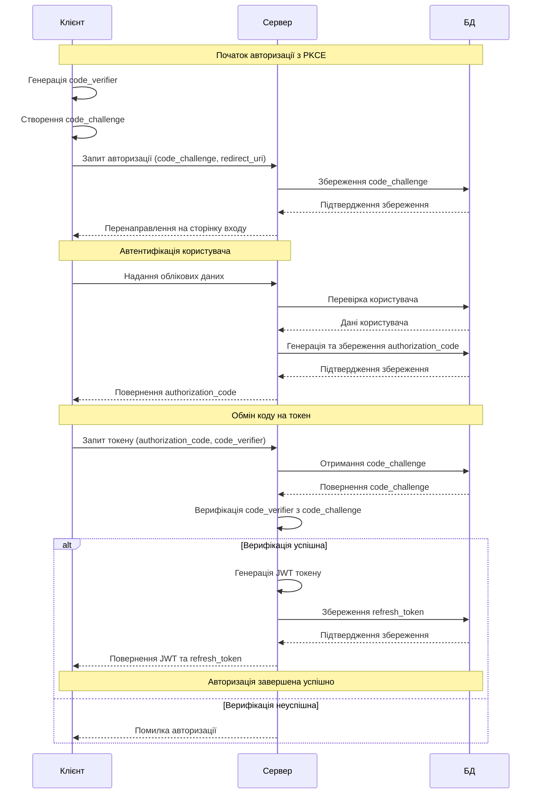

# UML Sequence Diagram: JWT + PKCE Авторизація

## Опис потоку:

1. **Ініціалізація PKCE**: Клієнт генерує `code_verifier` та створює `code_challenge`
2. **Запит авторизації**: Клієнт надсилає запит з `code_challenge` на сервер
3. **Автентифікація**: Користувач вводить облікові дані
4. **Генерація коду**: Сервер створює `authorization_code` та зберігає в БД
5. **Обмін на токен**: Клієнт обмінює код разом з `code_verifier` на JWT токен
6. **Верифікація**: Сервер перевіряє відповідність `code_verifier` та `code_challenge`
7. **Видача токену**: При успішній верифікації клієнт отримує JWT токен

Діаграма показує основний потік успішної авторизації з використанням стандартів OAuth 2.0 + PKCE та JWT токенів. 