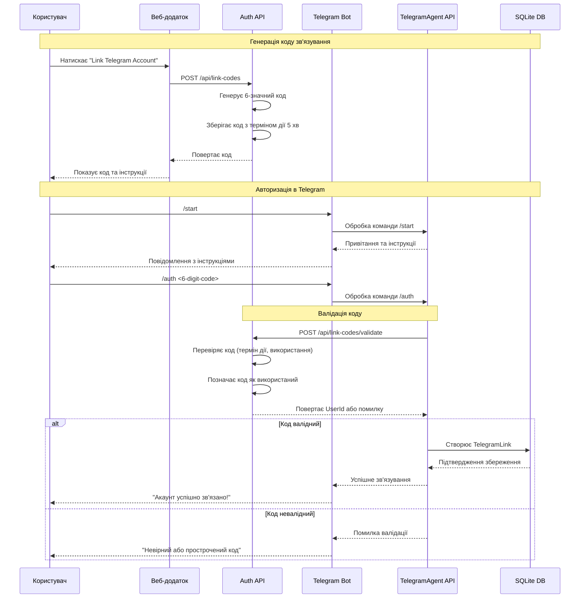
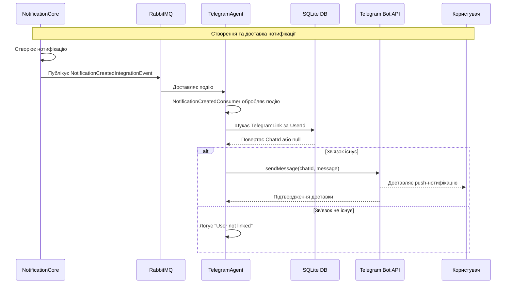
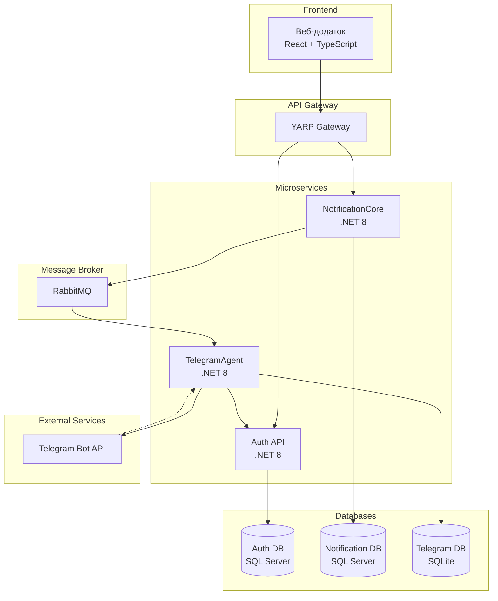

# Звіт про виконану роботу: Telegram Notification Мікросервіс

## Огляд проекту

Telegram мікросервіс є частиною розподіленої системи DormSystem, призначений для надсилання push-нотифікацій користувачам через Telegram Bot API. Сервіс реалізує функціональність зв'язування облікових записів користувачів з їх Telegram акаунтами та доставки нотифікацій.

## Архітектура проекту

### Архітектурний підхід: Vertical Slice Architecture

Проект побудований за принципом **Vertical Slice Architecture**, де кожна функціональність (feature) містить всі необхідні компоненти в одному місці:

```
TelegramAgent.API/
├── Features/
│   ├── AccountLinking/           # Зв'язування акаунтів
│   │   ├── LinkAccount.cs        # Command + Handler + Validator
│   │   ├── UnlinkAccount.cs      # Command + Handler + Validator
│   │   └── GetLinkStatus.cs      # Query + Handler
│   ├── NotificationDelivery/     # Доставка нотифікацій
│   │   └── NotificationCreatedConsumer.cs
│   └── Bot/                      # Telegram Bot команди
│       ├── Commands/
│       │   ├── StartCommand.cs
│       │   ├── AuthCommand.cs
│       │   ├── HelpCommand.cs
│       │   ├── UnlinkCommand.cs
│       │   └── StatusCommand.cs
│       ├── ITelegramCommand.cs
│       ├── TelegramCommandRegistry.cs
│       └── TelegramBotCommandHandler.cs
├── Data/
│   ├── TelegramDbContext.cs
│   └── Entities/
│       └── TelegramLink.cs
├── Services/
│   └── TelegramBotService.cs
└── Program.cs
```

### Переваги Vertical Slice Architecture:

1. **Локалізація змін** - всі зміни для конкретної функції знаходяться в одному місці
2. **Незалежність features** - кожна функція може розвиватися незалежно
3. **Простота тестування** - легко тестувати окремі функції
4. **Зрозумілість коду** - структура відображає бізнес-функціональність

## Технологічний стек

### Основні технології:

- **.NET 8** - основна платформа
- **ASP.NET Core** - веб-фреймворк
- **Entity Framework Core** - ORM для роботи з базою даних
- **SQLite** - база даних для зберігання зв'язків
- **MediatR** - паттерн Mediator для CQRS
- **FluentValidation** - валідація команд та запитів
- **MassTransit** - шина повідомлень для інтеграційних подій
- **RabbitMQ** - брокер повідомлень
- **Telegram.Bot** - SDK для роботи з Telegram Bot API

### Додаткові бібліотеки:

- **Swashbuckle.AspNetCore** - генерація Swagger документації
- **Microsoft.Extensions.Hosting** - фонові сервіси

## Структура бази даних

### Таблиця TelegramLinks

```sql
CREATE TABLE TelegramLinks (
    Id INTEGER PRIMARY KEY AUTOINCREMENT,
    UserId TEXT NOT NULL,
    ChatId BIGINT NOT NULL,
    LinkedAt DATETIME NOT NULL,
    UNIQUE(UserId),
    UNIQUE(ChatId)
);
```

**Поля:**
- `Id` - первинний ключ
- `UserId` - ідентифікатор користувача в системі DormSystem
- `ChatId` - ідентифікатор чату в Telegram
- `LinkedAt` - дата та час зв'язування

## Основні компоненти системи

### 1. Telegram Bot Commands

**Доступні команди:**
- `/start` - початкова команда, привітання користувача
- `/auth <code>` - авторизація за 6-значним кодом
- `/help` - довідка по командах
- `/unlink` - відв'язування акаунту
- `/status` - перевірка статусу зв'язування

### 2. Integration Events

**NotificationCreatedIntegrationEvent** - подія, що надходить з NotificationCore сервісу:
```csharp
public record NotificationCreatedIntegrationEvent
{
    public Guid NotificationId { get; init; }
    public string UserId { get; init; } = string.Empty;
    public string Title { get; init; } = string.Empty;
    public string Message { get; init; } = string.Empty;
    public DateTime CreatedAt { get; init; }
}
```

### 3. Background Services

**TelegramBotService** - фоновий сервіс для обробки оновлень від Telegram:
- Long polling для отримання повідомлень
- Делегування команд до відповідних обробників
- Обробка помилок та логування

## Процеси та взаємодії

### 1. Процес авторизації користувача

1. Користувач генерує код в веб-інтерфейсі
2. Користувач надсилає команду `/auth <code>` боту
3. Бот валідує код через Auth сервіс
4. При успішній валідації створюється зв'язок в базі даних
5. Користувач отримує підтвердження

### 2. Процес доставки нотифікацій

1. NotificationCore створює нотифікацію
2. Публікується NotificationCreatedIntegrationEvent
3. TelegramAgent отримує подію через RabbitMQ
4. Перевіряється наявність зв'язку для користувача
5. Надсилається повідомлення через Telegram Bot API

## Mermaid діаграми

### Діаграма послідовності: Процес авторизації користувача



### Діаграма послідовності: Доставка нотифікацій



### Архітектурна діаграма системи



## Патерни та принципи

### 1. CQRS (Command Query Responsibility Segregation)
- Команди: `LinkAccountCommand`, `UnlinkAccountCommand`
- Запити: `GetLinkStatusQuery`
- Розділення відповідальності між читанням та записом

### 2. Mediator Pattern
- Використання MediatR для розв'язування залежностей
- Централізована обробка команд та запитів

### 3. Repository Pattern (неявно через EF Core)
- DbContext як Unit of Work
- DbSet як Repository

### 4. Command Pattern
- Telegram команди реалізують ITelegramCommand
- Реєстр команд для динамічного виклику

### 5. Event-Driven Architecture
- Асинхронна обробка через RabbitMQ
- Слабка зв'язаність між сервісами

## Конфігурація та налаштування

### appsettings.json
```json
{
  "ConnectionStrings": {
    "DefaultConnection": "Data Source=TelegramAgent.db"
  },
  "TelegramBot": {
    "Token": "YOUR_BOT_TOKEN"
  },
  "RabbitMQ": {
    "Host": "localhost",
    "Username": "guest",
    "Password": "guest"
  },
  "AuthService": {
    "BaseUrl": "https://localhost:7001"
  }
}
```

## Безпека та валідація

### 1. Валідація команд
- FluentValidation для всіх команд
- Перевірка обов'язкових полів та форматів

### 2. Обробка помилок
- Try-catch блоки в критичних місцях
- Логування помилок
- Graceful degradation

### 3. Авторизація
- Валідація кодів через Auth сервіс
- Унікальність зв'язків (один користувач - один Telegram)

## Тестування

### Рекомендації для тестування:
1. **Unit тести** для команд та обробників
2. **Integration тести** для MassTransit consumers
3. **E2E тести** для Telegram Bot команд

## Моніторинг та логування

### Логування:
- Використання вбудованого ILogger
- Логування всіх важливих операцій
- Структуроване логування для кращого аналізу

### Метрики:
- Кількість оброблених нотифікацій
- Час відгуку Telegram API
- Кількість активних зв'язків

## Масштабування та продуктивність

### Можливості масштабування:
1. **Horizontal scaling** - запуск декількох інстансів
2. **Database sharding** - розподіл даних по регіонах
3. **Caching** - кешування активних зв'язків
4. **Rate limiting** - обмеження запитів до Telegram API

## Висновки

Telegram мікросервіс успішно реалізований з використанням сучасних архітектурних підходів та технологій. Vertical Slice Architecture забезпечує гнучкість та підтримуваність коду, а event-driven підхід гарантує слабку зв'язаність з іншими сервісами системи.

### Ключові досягнення:
- ✅ Реалізовано повний цикл авторизації через 6-значні коди
- ✅ Налаштовано асинхронну доставку нотифікацій
- ✅ Створено гнучку систему Telegram команд
- ✅ Забезпечено надійність через валідацію та обробку помилок
- ✅ Підготовлено архітектуру для майбутнього масштабування

Система готова до продуктивного використання та подальшого розвитку. 