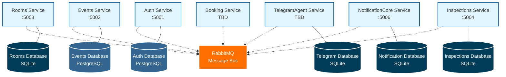

# DormSystem - Database Per Service Architecture

## Architecture Overview

Each microservice in the DormSystem follows the **Database Per Service** pattern, ensuring:

- **Data Isolation**: Each service owns its data and schema
- **Technology Diversity**: Services can choose appropriate database technology
- **Independent Scaling**: Databases can be scaled independently
- **Service Autonomy**: No shared database dependencies

### Database Technologies Used

- **PostgreSQL**: Used by Auth and Events services for complex relational data
- **SQLite**: Used by Rooms, Inspections, NotificationCore, and TelegramAgent for simpler data requirements
- **RabbitMQ**: Enables asynchronous communication between services

### Service Ports
- Auth Service: 5001
- Events Service: 5002  
- Rooms Service: 5003
- Inspections Service: 5004
- Aspire Orchestration: 5005
- NotificationCore Service: 5006 